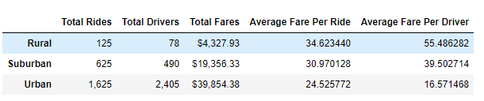
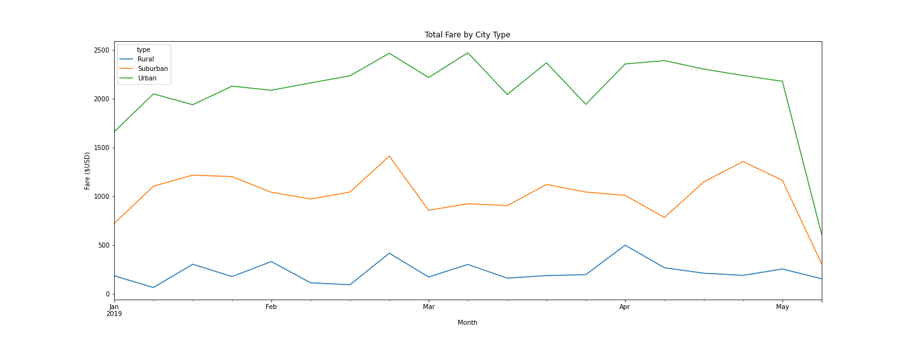

# pyber_analysis
Week 5 - Pyber analysis

## Overview of the analysis: 

The purpose of this analysis is to analyze the data given on the ride sharing company, PyBer. By utilizing Python, Pandas and Matpotlib, we were instructed to create a multi-lined graph to show PyBer the total weekly fares for each city type, Urban, Suburban and Rural as well as a summary dataframe of the information gathered from the data that was given to us. Finally, a written report has to be submitted that summarizes our findings as well as how each city types differs from one another and how these findings can be used by the decision makers at PyBer. 

## Results: 

>According to the PyBer Summary table above, the rural cities has the least total rides, drivers and fares. However, the average fare per ride and average fare per driver is the highest amongst the 3 city types. The urban cities have the most amount of total rides, driver and fares, but the lowest average fare per ride and average fare per driver. The suburban cities is in the middle of the two other city types. The data presented tells us that it is more costly to receive a ride in rural cities compared to urban cities as well as there are more drivers and ability to catch a ride in urban cities compared to rural cities.

>The above graph is a visual representation of the ride share data for the PyBer Fare by City Type. For all city types, there are a few spikes in terms of the fare. Like the summary table, this graph also shows that the majority of the fare being generated comes mostly from urban cities, then suburban cities and lastly, rural cities. Judging from both the summary table and the graph, it is clear that the average fare for a ride in rural cities is the highest, but the most money being generated is in urban cities overall.

## Summary: 

Based on the results from this analysis, one recommendation that can be given is the length of the ride. Depending on how far the driver is taking the passenger, this could also be the reason why the average fare per ride in rural cities is high and in urban cities is low. Another recommendation is performing a comparison of the data to include drivers per capita. Due to the lower number of drivers in rural cities compared to suburban and urban cities respectively, it would be interesting to compare the city types to the ratio of drivers per capita. The last recommendation would be to clearly define what makes a city urban, suburban or rural. Currently, we are just trusting the judgement of the data presented to us, but it would make the data more accurate if there was criteria to categorize a city as urban, suburban or rural.
